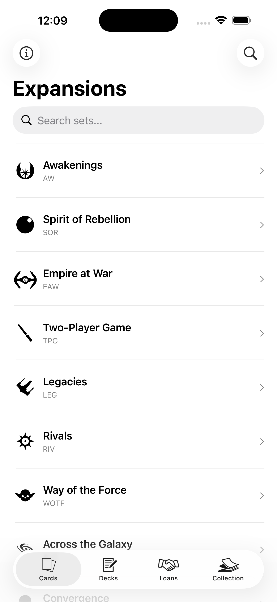
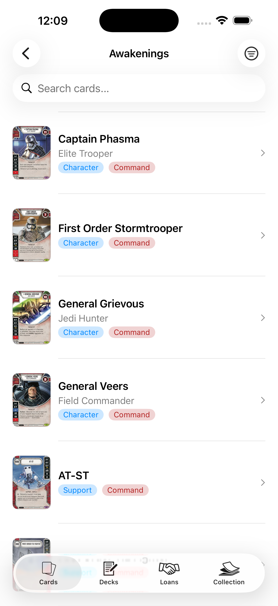
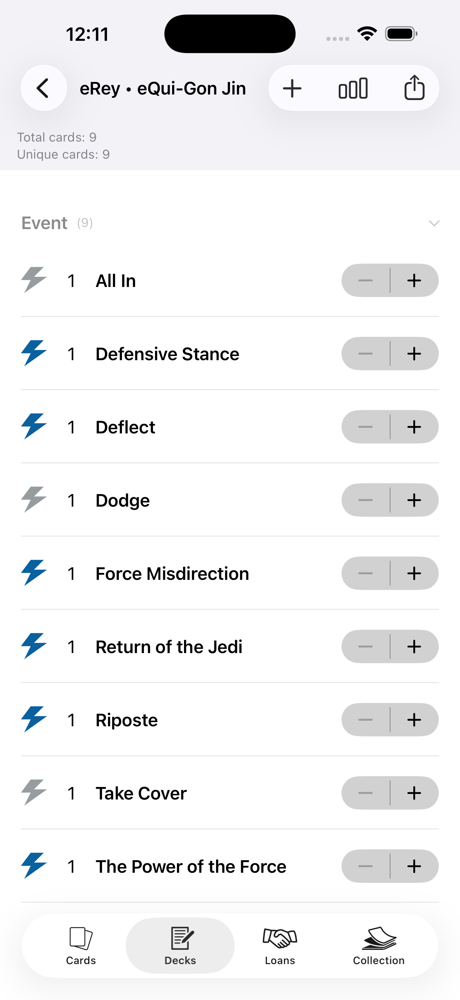
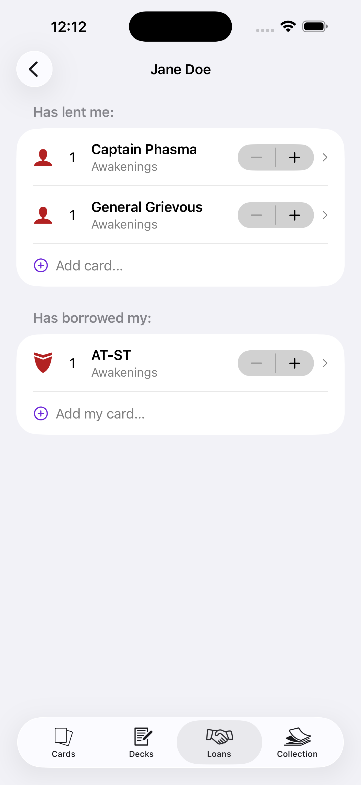
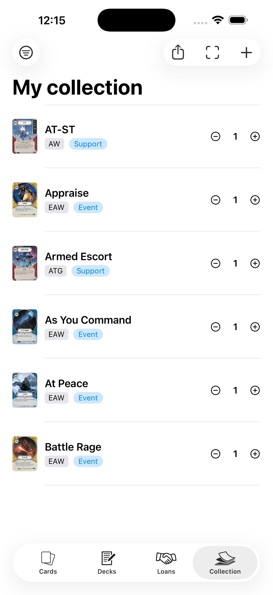

<p align="center">
  
</p>

<h1 align="center">SWDestiny Trades</h1>

<p align="center">
  Everything you need for <strong>Star Wars: Destiny</strong>, right at your fingertips.
</p>

<p align="center">
  <a href="https://github.com/dogo/swdestiny-trades/actions"></a>
  <a href="https://codecov.io/gh/dogo/swdestiny-trades"></a>
  <a href="https://apps.apple.com/app/id1191650293"></a>
  
  <a href="LICENSE"></a>
</p>

<p align="center">
  <a href="https://apps.apple.com/app/id1191650293">
    
  </a>
</p>

## About

SWD Trades puts everything you need for Star Wars Destiny right at your fingertips. Search the complete card database by set or name, build and tune decks, manage your entire collection, and keep track of every card you've lent out or borrowed.

### Features

- 🃏 The most complete Star Wars Destiny card database.
- 📷 Scan cards with your camera to add them instantly.
- 🤝 Track cards you've lent out or borrowed from friends.
- 🛠️ Build decks with built-in statistics.
- 🔎 Sort your cards alphabetically, by color, or by set number.
- 🗂️ Manage your full collection in one place.
- 📤 Share cards, your collection, or your decks with friends.
- 📱 Universal app for iPhone and iPad.
- ✨ Built for iOS 26 with Liquid Glass.

## Screenshots

| Expansions | Card List | Deck Builder | Loans | Collection |
|:---:|:---:|:---:|:---:|:---:|
|  |  |  |  |  |

## Building

### Requirements

- Xcode 26+
- [mise](https://mise.jdx.dev) — manages the toolchain (Tuist, SwiftLint, SwiftFormat, SwiftGen, Ruby)

### Setup

Install the pinned tool versions:

```bash
mise install
```

Fetch dependencies and generate the workspace with [Tuist](https://tuist.dev):

```bash
tuist install
tuist generate --no-open
```

Then open the workspace and build:

```bash
open swdestiny-trades.xcworkspace
```

## Tech stack

- **SwiftUI** for the UI
- **[Tuist](https://tuist.dev)** for project generation
- **[Kingfisher](https://github.com/onevcat/Kingfisher)** for image loading and caching
- **Firebase** for crash reporting
- **[fastlane](https://fastlane.tools)** for screenshots, metadata, and App Store releases
- **Core ML** — the card scanner runs a fine-tuned MobileCLIP model on-device (see `Tooling/ml`)
- Unit and snapshot tests ([ios-snapshot-test-case](https://github.com/uber/ios-snapshot-test-case)), running on GitHub Actions

## Contributing

I'm sure there are ways of improving and adding more features, so feel free to collaborate with ideas, [issues](https://github.com/dogo/swdestiny-trades/issues) and/or pull requests.

## License

SWDestiny Trades is released under the [MIT license](LICENSE).

---

*This app is not produced, endorsed, supported, or affiliated with Fantasy Flight Games.*
